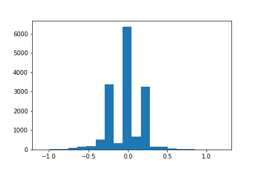

# **Behavioral Cloning Project**

---
[//]: # (Image References)

[image1]: ./img/center-1.jpg "Original image"
[image2]: ./img/cropped.jpg "Cropped image"
[image3]: ./img/flipped.jpg "Flipped image"
[image4]: ./img/steering_hist.png "Histogram Training Data"

## Model Architecture and Training Strategy

### 1. An appropriate model architecture has been employed in file model.py

For this project, I implemented the model architecture proposed by nVidia's self driving car team (`model.py` lines 20-86). The input images are first normalized by a Keras lambda layer. The normalized images are then cropped to remove irrelevant parts at the top and the bottom of the image (i.e. landscape and hood). Figure 1 shows the resulting image after cropping.

<tabular>
    <table>
        <tr><td></td><td></td></tr>
        <tr><td>
Original
</td><td>
Cropped
</td></tr>
    </table>
    <caption>
Fig.1: Image Preprocessing - Cropping
</caption>
</tabular>

Building up on these preprocessing steps, nVidia's architecture consists of three convolutional layers with 5x5 filter sizes and depths 24, 36, and 48, followed by another two convolutional layers with 3x3 filter sizes and 64 depth. nVidia's architecture also includes RELU layers to introduce nonlinearity. After flattening the data, the final result is computed by four fully connected layers of sizes 100, 50, 10, and 1. I also added a Dropout layer following up on the first fully connected layer in order to prevent the model from overfitting (`model.py` line 54).

### 2. Attempts to reduce overfitting in the model

The model was trained and validated on different data sets to ensure that the model was not overfitting. 
The model was tested by running it through the simulator and ensuring that the vehicle could stay on the track. The model architecture also incorporated a Dropout layer to reduce overfitting.

### 3. Model parameter tuning

The model used an adam optimizer, so the learning rate was not tuned manually. 
The best performance was achieved after training the model for 5 epochs and using a validation split of 15%.

### 4. Appropriate training data

Training data was chosen to keep the vehicle driving on the road. I used a combination of center lane driving, recovering from the left and right sides of the road to obtain a balanced training set.
For details about how I created the training data, please see next section. 

## Design Strategy

My first step was to implement nVidia's architecture. Then, I shuffled the data set and split my image and steering angle data into 85% training and 15% validation samples. Upon training, I tested my model by running the simulator.

Using the given data set, the model performed well on straight, and outlined sections, however performed poorly on curvy sections. Also once the vehicle left the center of the road it was rarely able to recover and frequently went off the track. 

Therefore, the most challenging part of this project was to compose a training set that allows the car to drive smoothly around corners without overfitting on straight sections. Since the track predominantly consisted of 'driving straight', I particulaty recorderd maneuvers with large steering angles. I also added 'recovering maneuvers' by drifting towards the side of the road and steering back to the center. 

<tabular>
    <table>
        <tr><td></td></tr>
    </table>
    <caption>
Fig.2: Histogram of steering angles
</caption>
</tabular>

Figure 2 shows the distribution of the steering angles. The large peak at around 0.0° indicates a high number of straight sections. The two dominant peaks at -0.2° and 0.2° are caused by adding an offset of +-0.2° to the steering angle for image augmentation.

Additionally, I augmented the data set by flipping the center image (`model.py` lines 139-150) and its respective steering angle. Figure 3 shows the original center image and the corresponding flipped version used in the augmented data set.

<tabular>
    <table>
        <tr><td></td><td></td></tr>
        <tr><td>
Original
</td><td>
Flipped
</td></tr>
    </table>
    <caption>
Fig.3: Image Augmentation - Flipped center image
</caption>
</tabular>

Although, the histogram in Figure 2 indicates a rather unbalanced dataset, which mainly contains driving straight maneuvers, the final model performed well on the track and the car was always able to recover and steer back to center of the lane.

## Video

